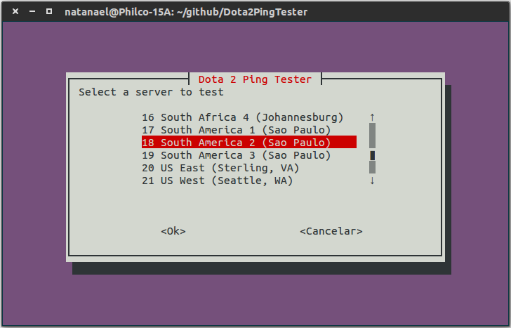

Dota 2 Ping Tester
===================


Screenshot of the running program.

-------

About
-----------
This is a simple program for linux that allows the calculation of ping (connection latency) in the Dota 2 servers.
The program runs in the terminal and uses an interactive interface.


Running
-----------
```bash
chmod +x Dota2PingTester.sh
./Dota2PingTester.sh
``` 

or simply:

```bash
bash Dota2PingTester.sh
```

>**Important: ** Use the command **bash** and not **sh**!
